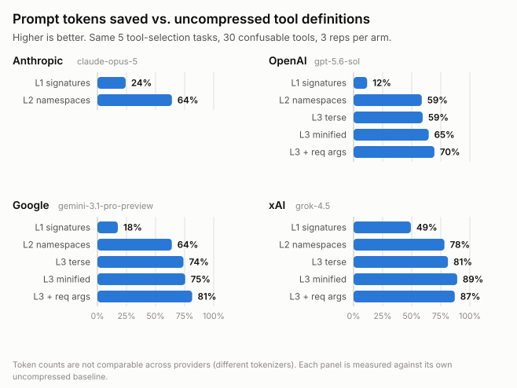
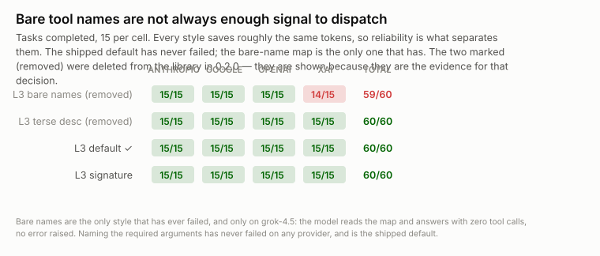
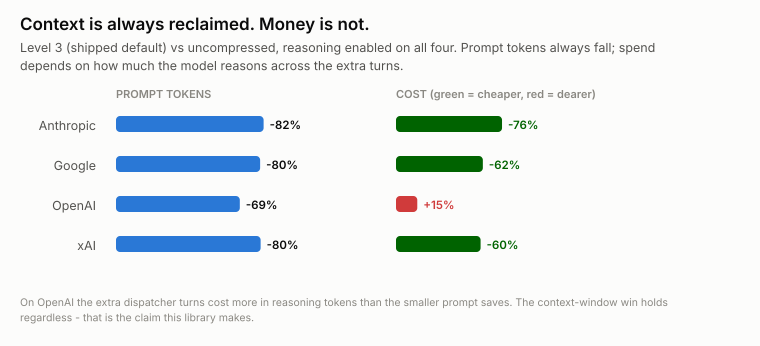

<h1>toolgz</h1>

<p><strong>Your agent spends 30–70k tokens of context on tool definitions before the user types a word. toolgz gets up to ~85% of it back.</strong></p>

<p><em>On a large tool set, at level 3. The default (level 1) reclaims 13–39% and gives up nothing. <code>recommendLevel()</code> tells you which one your tools want; you pass its answer in.</em></p>

<p>
<a href="#measured-results">420-run cross-provider sweep</a> ·
4 frontier models ·
zero runtime dependencies ·
<a href="docs/BEFORE-AFTER.md">generated before/after</a>
</p>

```bash
npm install toolgz
```

> ### 🤖 If a coding agent is reading this
>
> Point it at **[`llms.txt`](llms.txt)** — prescriptive integration instructions written
> for an agent, shipped inside the package at `node_modules/toolgz/llms.txt`. It covers
> the three-step contract, the rules that are not optional, per-model behaviour, and a
> `Do not` list of the mistakes we have actually fielded.
>
> ```
> Read node_modules/toolgz/llms.txt before integrating toolgz.
> ```

---

## The problem

You connect a few MCP servers. Each ships 20–50 tools. Every tool is a JSON Schema with a
sentence of prose per parameter. That block renders at the **front of every single request**.

A realistic tool definition is ~420 tokens, and roughly 400 of them are prose the model
doesn't need in order to pick correctly. Fifty tools is 20k tokens. A hundred is 40k.

Prompt caching makes those tokens *cheap*. It does not make them take up less *room*.
Reclaiming the room is what this does.

## The fix, in three lines

```ts
import { compress, recommendLevel, forAnthropic } from "toolgz";

const { level } = recommendLevel(myTools);    // advice: 1 for a small block, 3 for a big one
const c = compress(myTools, { level });       // your existing MCP/SDK tool array
const { tools, system } = forAnthropic(c);    // send these instead
```

`compress(myTools)` with no `level` gives you **level 1** — safe, native tool calling,
provider schema enforcement intact, and 13–39% smaller (13–32% on the synthetic benchmark, 39% on the real 149-tool corpus). The 71–85% figures below are
**level 3**, which is what `recommendLevel` returns once a tool set is big enough to
amortise the dispatcher.

**Note the shape of those three lines: `recommendLevel` only advises, and you pass its
answer back in.** Nothing upgrades itself — `compress(myTools)` is level 1 whether you
have 2 tools or 500. See [Which level to use](#which-level-to-use) for why.

Then translate the model's call back before you dispatch:

```ts
const r = c.resolve(block.name, block.input);
if (r.kind === "call") await myDispatch(r.name, r.args);   // real name, real args
```

`myDispatch` gets exactly what it got before. **Nothing downstream changes.**

---

## Measured results

Four frontier models, seven strategies, five tool-selection tasks, 3 reps —
**420 runs** on the current sweep, 1,200+ across all rounds. Every raw per-run record is
committed in [`bench/results/`](bench/results/); recompute any figure with
`npx tsx bench/analyze-multi.ts --sweep=<timestamp>`.

**The table below uses a synthetic catalogue** — 100 realistic-but-invented MCP-style
tools across 9 namespaces — because it lets us build deliberately confusable clusters
that a real catalogue may not contain. Two things follow from that, and the first is
uncomfortable:

- Synthetic naming can flatter a compression style. One map style measured −21% on
  this fixture because every tool name carried a `namespace_op` prefix to factor out.
  On real MCP tools, which mostly do not, the same style was worth −1%.
- Real catalogues are **bigger**, so these numbers understate the problem. A corpus of
  **149 tools harvested from 14 live MCP servers** measures **68,494 prompt tokens**
  uncompressed on `claude-opus-5` — more than twice the synthetic fixture, and about a
  third of a 200k context window before the user types anything.

The real corpus is committed at [`bench/fixtures/real-mcp-tools.json`](bench/fixtures/real-mcp-tools.json)
with its own scenario suite (`--suite=real`), and it is the corpus of record for any
claim about real deployments.

<picture>
  <source media="(prefers-color-scheme: dark)" srcset="docs/img/savings-dark.svg">
  
</picture>

**All figures below are level 3** (`minified-plus`, the shipped default map style).
Level 1 on the same sweep saves 13–32%; on the real 149-tool corpus it saves 39%; level 2 is dominated by level 3.

| Provider | Model | Tool block | Prompt tokens | Latency | Tasks |
|---|---|---:|---:|---:|:-:|
| Anthropic | `claude-opus-5` | 9,242 → **1,284** | 30,817 → **4,628** (**−85%**) | 15.0s → **12.1s** | 15/15 |
| xAI | `grok-4.5` | 6,421 → **775** | 17,522 → **2,663** (**−85%**) | 6.1s → **4.6s** | 15/15 |
| Google | `gemini-3.1-pro-preview` | 5,264 → **732** | 10,948 → **2,302** (**−79%**) | 5.6s → **5.5s** | 15/15 |
| OpenAI | `gpt-5.6-sol` | 2,752 → **573** | 7,694 → **2,196** (**−71%**) | 6.8s → **5.6s** | 15/15 |

Reasoning is enabled on all four at high effort, so this is a like-for-like frontier
comparison. **60/60 tasks completed, zero hallucinated tool names, zero malformed
arguments** — and it is faster than uncompressed on every provider.

Recompute any figure with
`npx tsx bench/analyze-multi.ts --sweep=2026-07-25T19-19` against the raw per-run
records in [`bench/results/`](bench/results).

### How it scales, measured on real tools

The table above is a synthetic 100-tool fixture. This is the real one: **149 tools
harvested from 14 live MCP servers**, scaled by replicating the corpus, measured with
Anthropic's `count_tokens` and confirmed against live API calls.

| Tools | Uncompressed | Level 3 | Reclaimed |
|---:|---:|---:|---:|
| 149 (the real corpus) | 68,536 | **3,022** | **95.6%** |
| 435 | 199,822 | **8,690** | **95.7%** |
| 800 | 368,826 | **16,006** | **95.7%** |
| 1,200 | 552,795 | **23,880** | **95.7%** |

**The ratio does not decay with scale.** Both the uncompressed block and the map grow
linearly, so 95.7% holds from 149 tools to 1,200. Real MCP tools measure ~460 tokens
each — 17% heavier than the ~393 in the published academic benchmark, so a real
catalogue hits limits sooner than synthetic ones suggest.

Which gives a practical ceiling per context window:

| Context window | Tools that fit uncompressed | With level 3 |
|---|---:|---:|
| 8K (small/local models) | **17** | ~409 |
| 32K | 71 | ~1,638 |
| 200K (typical frontier cap) | **434** | ~10,000 |

That 200K row is the one to note: **most deployments cap at 200k, making ~434 real
tools a hard ceiling.** An independent study ([Sakizli 2026](https://github.com/SKZL-AI/tscg))
measured the same threshold at ~494 tools using tools 17% lighter than ours — two
separate measurements agreeing within about 15%.

### What we could not test

**We have not demonstrated that compression improves accuracy, and we do not claim it.**

The published study above finds a *binary enablement* effect: at 8K with 28 tools,
uncompressed schemas overflow the window and exact-match accuracy collapses to 2.6%,
while compression restores it (+20.5pp average). At 32K, where both fit, four of five
models show ≤1pp difference — the effect is **budget-driven, not intrinsic**.

We tried to reproduce it and could not, for an honest reason: every provider we test
against has a window far larger than our corpus needs. Uncompressed requests ran
successfully at 149, 435 and **800 tools (368,826 tokens)** on `claude-opus-5`, picking
the correct tool each time. Reaching overflow on a 1M window would take ~2,173 tools.

So the enablement regime — where this stops being an optimisation and becomes a
prerequisite — lives on **small-context models we do not currently test**. If you run
local models at 8K–32K, that study is more relevant to you than our benchmarks are.

### What about cost?

**Cost is not the claim, and we deliberately do not lead with it.** Prompt caching
already makes tool tokens cheap. What caching does not do is give you the *room* back,
and the room is what you run out of.

Cost does usually fall as a side effect, by an amount that depends on your provider
and reasoning settings — and on one of four providers we measured, it does not fall at
all. On `gpt-5.6-sol` the uncompressed cost distribution is heavily right-skewed (mean
$0.0172, median $0.0052), so a few expensive runs make compression look break-even
while the *typical* run gets about 2.5× dearer. We used to publish a "−7% on OpenAI"
figure. It was a mean over a skewed distribution and we withdrew it.

If you do want to optimise the bill, it is one option — and it is a trade, not a
freebie:

```ts
compress(myTools, { level: 3, model: "gpt-5.6-sol", objective: "cost" });
```

| Model | Median cost vs default |
|---|---:|
| `gpt-5.6-sol` | **−20.7%** |
| `gemini-3.1-pro-preview` | **−15.4%** |
| `claude-opus-5` | **−9.0%** |
| `grok-4.5` | **+13.2%** — so it is not enabled there |

From 432 runs, 36 per style per provider, on the real 149-tool corpus. **What you give
up:** a slightly larger cached map (+275 characters), and on `grok-4.5` a worse bill —
which is why that row keeps the default rather than the cost-optimised style. Omit
`objective` and you get the conservative default everywhere, unchanged.

### It does not make the model worse

That was the thing to disprove, and we tried hard to. The task suite is built from
deliberately confusable tool clusters — `search_issues` vs `list_issues`, comment-vs-update,
approve-vs-merge, the same three products side by side — where the correct choice turns on
the tool name that compression takes away.

<picture>
  <source media="(prefers-color-scheme: dark)" srcset="docs/img/reliability-dark.svg">
  
</picture>

The model doesn't lose the ability to choose — it converts a recall problem into a retrieval
problem and looks up what it needs. The default map style exists because of the red cell:
bare tool names failed on `grok-4.5` **deterministically**, 3 of 3 attempts on one scenario,
answering with zero tool calls and no error raised. Naming the required arguments fixed it.

### How we found the cost story, and got it wrong twice

<picture>
  <source media="(prefers-color-scheme: dark)" srcset="docs/img/cost-dark.svg">
  
</picture>

The first cross-provider sweep found cost going **up 15% on OpenAI** even while context
fell 69%. The dispatcher was spending extra turns, and on a reasoning model every turn
pays for a fresh round of thinking.

So we captured the calls being rejected instead of guessing, and found three bugs in
*this library*: models pass `query` to a parameter named `q` (14 of 18 rejections), they
sometimes call the map code as the tool name, and they sometimes pass arguments flat
instead of nested. Fixing all three drove malformed arguments to **zero on every
provider**. Later rounds found three more of the same kind — a namespace joined with a
dot, the lookup tool routed through the dispatcher — all shipped in 0.1.2.

That is the honest shape of this work: **most of the wins came from accepting what
models actually send, not from making the map smaller.** One extra turn is worth ~3,300
prompt tokens; the best encoding change available was worth ~550. Six map styles were
tried and removed in 0.2.0 because they were smaller and still worse.

---

## Which level to use

### The whole idea, in plain English

Your tool definitions are a **menu** handed to the model at the start of every single
conversation. It is long, and most of it is flowery prose about each dish.

- **Level 1** — the same menu with the prose cut. It is still a real menu: the model
  points at a dish **by name**, and *the kitchen checks the order makes sense* before
  cooking. This is the default, and it gives up nothing.
- **Level 3** — throw the menu away. Hand the model a **numbered list** and one waiter.
  It says "number 12, no onions," and the waiter knows what that means. The list is
  tiny. But the kitchen no longer checks the order — **toolgz checks it instead**,
  against your original schema, and hands back a readable error if it's wrong.

If the model needs to know what number 12 comes with, it asks. That's the `q()` lookup,
and it costs about half a turn.

So: **level 1 is smaller. Level 3 is much smaller and you take over order-checking.**

### Two things that surprise people

**1. Nothing changes level on its own. You are always the one who picks.**

```ts
compress(myTools)                    // level 1. ALWAYS — 2 tools or 500.
compress(myTools, { level: 3 })      // level 3, because you asked for it

const { level } = recommendLevel(myTools);   // just advice: returns 1 or 3
compress(myTools, { level });                // now it's 3, because you passed it in
```

`recommendLevel()` **advises**; it does not act. On our 149-tool corpus,
`compress(myTools)` saves 45.2% and `compress(myTools, { level: 3 })` saves 96.5% — so
forgetting to pass the level back in quietly leaves half the win on the table.

This is deliberate. Level 3 gives up provider-side schema enforcement, and silently
changing a caller's correctness guarantees because their tool array grew would be a
worse bug than the tokens are worth.

**2. It switches on how *big* the block is, not how *many* tools you have.**

A tool can be 20 tokens or 460, so counting them tells you very little:

| Tool set | Level 1 block | Recommends |
|---|---:|:-:|
| 72 tools, one parameter each | ~5,000 tokens | **1** |
| 200 tools, one parameter each | ~14,100 tokens | **3** |
| **40** real MCP tools | ~10,600 tokens | **3** |
| 149 real MCP tools | ~42,700 tokens | **3** |

Forty chatty tools cross the line while 72 terse ones don't. The threshold is **10,000
tokens** — about 5% of a 200k window. Below that, reclaiming the block doesn't change
what fits, so keeping the provider's own argument validation is worth more than the
saving.

### The levels in full

Ask the library. It returns 1 or 3, never 2, and explains itself:

```ts
import { recommendLevel } from "toolgz";
const { level, reason } = recommendLevel(myTools);
```

| Level | Sends | Real names | Provider schema enforcement | Use when |
|:-:|---|:-:|:-:|---|
| **1** | one native tool each, signature-line descriptions | yes | **yes** | **default.** Small or wide-and-sparse tool sets. Zero measured downside. |
| 2 | one compound tool per namespace | yes | no | you need readable op names on the wire. Otherwise skip. |
| **3** | one dispatcher + one lookup tool | codes | no | **large, deep tool sets.** The 80% number above. |

*(Level 0 is a passthrough, for A/B testing inside your own app.)*

**Level 1 is free** — measured: fewer tokens, zero malformed arguments, zero extra turns,
latency no worse. **Level 2 is dominated by level 3** on every axis, including producing more
malformed arguments; it is not a stepping stone.

### What level 3 actually looks like

Two tools on the wire regardless of how many you start with, and a map in the system prompt
behind a cache breakpoint:

```
<toolmap>
a0 github_create_issue owner,repo,title
a1 github_search_issues q
b0 slack_post_message channel,text
</toolmap>
```

The model calls `t(f="a0", a={…})`, and `q(c="a0")` expands a code to its full signature when
it needs the optional parameters.

If you want to remove those lookups entirely, put the whole signature in the map:

```ts
compress(myTools, { level: 3, mapStyle: "signature" });
// a0 github_create_issue(owner,repo,title,body?,labels?)
```

Measured: lookups drop to zero and it was the **fastest and cheapest** arm on OpenAI (4.0s,
−17% cost). It is slightly larger, and on xAI it was worse than the default, so it is an
option rather than the default.

**The trade:** at levels 2–3 the model fills a generic argument object, so the provider's
sampler no longer enforces your schema. toolgz validates against your *original* schema and
returns a model-readable error instead. That is why `validate` defaults to on — leave it on.

**Every artifact above is generated by running the library** — see
**[docs/BEFORE-AFTER.md](docs/BEFORE-AFTER.md)** for the full tools array and system prompt,
before and after, at every level, with real token counts and a live encode → decode round
trip. A test asserts that file matches the code, so it cannot drift.

---

### `signature`: the level-3 style with no lookups

Worth calling out because it trades differently from the others. `signature` puts the full
parameter list in the map, so the model never needs a `q()` lookup — **measured 0.0 lookups
on all four providers**, against 0.1–0.5 for the default.

That makes it the fastest and cheapest option on OpenAI (4.0s vs 5.6s; median cost $0.0106
vs $0.0129) at the price of a larger cached map. But it is **not** universally better: on
grok-4.5 it was slower (7.4s vs 4.6s), dearer, and produced the one malformed argument in
that arm. Reach for it if lookups are your bottleneck and you are not on xAI.

---

## Optional: let the library pick the map style for your model

Level 3 has several map styles. Which one is cheapest turns out to depend on the
model, so you can hand `compress()` a model id and let it use what was actually
measured:

> **This is the one thing the library does choose for you, and only if you pass
> `model`.** Note the difference from levels: a map style is a pure encoding choice, so
> picking a better one cannot change your results. The level *can* — level 3 hands
> argument validation from the provider to toolgz — so that stays your explicit call.

```ts
compress(myTools, { level: 3, model: "gpt-5.6-sol", objective: "cost" });
```

| Model | Style chosen for `cost` | Measured against the default |
|---|---|---:|
| `gpt-5.6-sol` | `explicit` | **−20.7%** |
| `gemini-3.1-pro-preview` | `explicit` | **−15.4%** |
| `claude-opus-5` | `explicit` | **−9.0%** |
| `grok-4.5` | *default* | `explicit` measured **+13.2%** there |

From a 432-run sweep, 36 runs per style per provider, on the real 149-tool corpus.
`explicit` completed 144/144 tasks and cut lookups on all four providers; only the
*cost* consequence differs by model. The table lives in
[`src/policy.generated.ts`](src/policy.generated.ts), is generated from the committed
results, and a test fails if it drifts from them.

Four things worth knowing:

- **Omitting `model` changes nothing.** Existing behaviour is byte-identical; there
  is a test asserting that.
- **`objective` defaults to `occupancy`, which has no table.** Every style we
  measured landed within ±3.1% of the default on context occupancy — under our 5%
  effect-size floor — so there is nothing to select. Only `cost` has entries.
- **An absent model gets the default.** That is an absence of evidence, not a
  prediction. `gpt-5.6-sol` behaving one way says nothing certain about `gpt-5.7`.
- **`stats` always tells you what was actually used**, so nothing is substituted
  silently:

```ts
const c = compress(myTools, { level: 3, model: "gpt-5.6-sol", objective: "cost" });
c.stats.mapStyle;          // "explicit" — what was used
c.stats.requestedMapStyle; // undefined — you did not ask for a specific style
c.stats.fallbackReason;    // undefined — nothing was substituted
```

There is also a safety valve: if a future sweep finds a `(model, style)` pair that
fails, it is refused and `stats.fallbackReason` says why. **That table is currently
empty** — the one pair ever measured unsafe was `nocode` on `grok-4.5` (19% of runs
answered with no tool call at all), and rather than document a footgun we deleted the
style in 0.2.0.

---

## Runnable examples

Five files in [`examples/`](examples), all offline — no API key, no cost. Every one is
**executed by the test suite**, so an example that stops working is a failing test rather
than a bug report from you.

```bash
npx tsx examples/01-minimal.ts
```

**[`examples/README.md`](examples/README.md) walks through all five** with their real
output and what each one is trying to teach — start there if you would rather read than
run.

| File | Shows |
|---|---|
| [`01-minimal.ts`](examples/01-minimal.ts) | the smallest useful thing: `recommendLevel` → `compress` → `resolve` |
| [`02-agent-loop.ts`](examples/02-agent-loop.ts) | the full loop against a scripted model, covering all three `resolve()` outcomes including a recovery |
| [`03-mcp-servers.ts`](examples/03-mcp-servers.ts) | 149 real tools from 14 MCP servers, all four levels, and the name-collision hazard |
| [`04-providers.ts`](examples/04-providers.ts) | the four provider envelopes side by side, plus the Gemini schema repairs |
| [`05-per-model.ts`](examples/05-per-model.ts) | `model`/`objective` selection and reading `stats` to see what was actually used |

Two things `04-providers.ts` demonstrates rather than describes, because both have bitten
people: `/v1/responses` needs the **flat** tool shape when you set reasoning effort, and
Gemini returns **one** wrapper object containing all declarations, so you count
`tools[0].functionDeclarations.length`.

---

## Using it: the full guide

Everything below was a separate `docs/GUIDE.md`. It is inline now, deliberately: the
same claims lived in both files and drifted apart — the README advertised level 3's
savings while its own quick-start example used level 1. One document cannot contradict
itself.

Reference material that is generated or historical stays separate, because it is not
hand-maintained prose:

- **[docs/RESULTS.md](docs/RESULTS.md)** — every benchmark round, the raw evidence log
- **[docs/BEFORE-AFTER.md](docs/BEFORE-AFTER.md)** — generated by executing the library
- **[docs/RELEASING.md](docs/RELEASING.md)** — release process

---

## 1. The agent loop, in full

A complete, working Anthropic loop. The only additions to a normal loop are the
`compress()` call at the top and the `resolve()` call before dispatch.

```ts
import Anthropic from "@anthropic-ai/sdk";
import { compress, forAnthropic } from "toolgz";

const client = new Anthropic();
const SYSTEM = "You are a helpful operations agent. Use the tools available.";

// 1. Compress once, outside the loop. It is pure and deterministic.
const c = compress(myTools, { level: 3 });
const { tools, system } = forAnthropic(c);

export async function run(userMessage: string) {
  const messages: any[] = [{ role: "user", content: userMessage }];

  for (let turn = 0; turn < 12; turn++) {
    const res = await client.messages.create({
      model: "claude-opus-5",
      max_tokens: 8000,
      system: [{ type: "text", text: SYSTEM }, ...(system ?? [])],
      tools: tools as any,
      messages,
    });

    const calls = res.content.filter((b: any) => b.type === "tool_use");
    if (!calls.length) return res;          // model is done

    // 2. Echo the assistant turn back verbatim. On Anthropic this matters:
    //    thinking blocks must be returned unchanged or the model re-reasons.
    messages.push({ role: "assistant", content: res.content });

    const results: any[] = [];
    for (const call of calls) {
      const r = c.resolve(call.name, (call as any).input);

      if (r.kind === "call") {
        const output = await myDispatch(r.name, r.args);   // your real handler
        results.push({
          type: "tool_result",
          tool_use_id: call.id,
          content: JSON.stringify(output),
        });
      } else if (r.kind === "meta") {
        // The model asked toolgz a lookup question. Answer it; don't dispatch.
        results.push({
          type: "tool_result",
          tool_use_id: call.id,
          content: r.result,
        });
      } else {
        // Bad arguments or an unknown code. The message is written for the
        // model to read — hand it straight back and let it retry.
        results.push({
          type: "tool_result",
          tool_use_id: call.id,
          content: `Error: ${r.message}`,
          is_error: true,
        });
      }
    }

    messages.push({ role: "user", content: results });
  }
}
```

Three rules that matter:

1. **Call `compress()` once**, outside the loop. Calling it per turn is wasteful
   and, if you vary the options, breaks prompt caching.
2. **Never dispatch on `meta` or `error`.** Only `kind === "call"` is a real
   tool invocation.
3. **Feed errors back rather than throwing.** Recovery is the design; the error
   strings are written for the model.

---

## 2. Handling the three outcomes

`resolve()` returns a discriminated union. Handle all three.

```ts
const r = c.resolve(rawName, rawArgs);

switch (r.kind) {
  case "call":
    // r.name  → the original tool name, e.g. "github_create_issue"
    // r.args  → validated against your original schema
    await myDispatch(r.name, r.args);
    break;

  case "meta":
    // The model used a toolgz lookup tool (q / describe_op).
    // r.result is text to return as the tool result. Do not dispatch.
    reply(r.result);
    break;

  case "error":
    // r.message    → model-readable: names the tool, the parameter, the fix
    // r.recoverable → true when retrying can plausibly succeed
    reply(r.message, { isError: true });
    break;
}
```

What produces each:

| Outcome | Cause | You should |
|---|---|---|
| `call` | valid invocation | dispatch it |
| `meta` | model asked for a definition or searched the map | return `r.result` as the tool result |
| `error` | missing/unknown/wrong-typed argument, or an unknown code | return `r.message` with an error flag |

Argument validation runs against your **original** schema, not the compressed
one, so an `error` here means the call genuinely would not have worked.

---

## 3. Provider setup

The core is provider-neutral. Adapters handle wire shape and cache placement.
They are pure functions and never mutate what you pass them.

### Anthropic

```ts
import { compress, forAnthropic } from "toolgz";

const c = compress(myTools, { level: 3 });
const { tools, system } = forAnthropic(c);          // or { ttl: "1h" }

await client.messages.create({
  model: "claude-opus-5",
  max_tokens: 8000,
  system: [{ type: "text", text: SYSTEM }, ...(system ?? [])],
  tools,
  messages,
});
```

`forAnthropic` places exactly one `cache_control` breakpoint on the last
eligible tool, and skips any tool carrying `defer_loading` because the API
rejects that combination.

### OpenAI

OpenAI has **two endpoints with two different tool shapes**, and toolgz has an
adapter for each. Pick by whether you want reasoning.

**If you want tools *and* reasoning — use `/v1/responses`.** On the GPT-5.x
line, `/v1/chat/completions` refuses the combination outright:

```
Function tools with reasoning_effort are not supported for gpt-5.6-sol in
/v1/chat/completions. To use function tools, use /v1/responses or set
reasoning_effort to 'none'.
```

```ts
import { compress, forOpenAIResponses } from "toolgz";

const c = compress(myTools, { level: 3 });
const { tools, systemPreamble } = forOpenAIResponses(c);   // flat tool shape

const res = await client.responses.create({
  model: "gpt-5.6-sol",
  reasoning: { effort: "high" },
  max_output_tokens: 8000,
  tools,
  input: [
    { type: "message", role: "developer",
      content: SYSTEM + (systemPreamble ? "\n\n" + systemPreamble : "") },
    { type: "message", role: "user", content: userMessage },
  ],
});
```

Two things about `/v1/responses` that will bite you otherwise:

- History is a flat `input[]` list, not `messages`. A tool call round-trip is
  `{type:"function_call", call_id, name, arguments}` followed by
  `{type:"function_call_output", call_id, output}`.
- **Reasoning items must be echoed back** alongside tool outputs on the next
  turn, or the model re-reasons from scratch every turn. Push the whole
  `response.output` array back verbatim.

**If you don't need reasoning**, chat completions is fine and the tool shape is
the nested one:

```ts
import { compress, forOpenAI } from "toolgz";

const { tools, systemPreamble } = forOpenAI(compress(myTools, { level: 3 }));

await client.chat.completions.create({
  model: "gpt-5.6-sol",
  messages: [
    { role: "system", content: SYSTEM + (systemPreamble ? "\n\n" + systemPreamble : "") },
    ...messages,
  ],
  tools,
});
```

Either way, OpenAI's prefix caching is automatic with a ~1024-token floor, so
there is no breakpoint to place — just keep your prefix stable. Cached input
bills at roughly a tenth of the normal rate.

`forOpenAI` emits `{type:"function", function:{…}}`; `forOpenAIResponses` emits
the flat `{type:"function", name, …}`. Sending one shape to the other endpoint
is a validation error, so match them.

### Google Gemini

```ts
import { compress, forGemini } from "toolgz";

const c = compress(myTools, { level: 3 });
const { tools, systemPreamble } = forGemini(c);

await ai.models.generateContent({
  model: "gemini-3.1-pro-preview",
  contents,
  config: {
    systemInstruction: SYSTEM + (systemPreamble ? "\n\n" + systemPreamble : ""),
    tools,
  },
});
```

`forGemini` strips the JSON Schema keywords Gemini rejects
(`additionalProperties`, `$schema`, `default`, `examples`) recursively.

### xAI

xAI's API is OpenAI-compatible, so use `forOpenAI`:

```ts
import OpenAI from "openai";
import { compress, forOpenAI } from "toolgz";

const client = new OpenAI({
  apiKey: process.env.XAI_API_KEY,
  baseURL: "https://api.x.ai/v1",
});
const { tools, systemPreamble } = forOpenAI(compress(myTools, { level: 3 }));
```

> **Note:** xAI excludes reasoning tokens from `completion_tokens`. If you're
> tracking spend, add `usage.completion_tokens_details.reasoning_tokens`.

---

## 4. Prompt caching

**Read this even if you skip everything else.** Prompt caching is what makes the
per-turn cost of your tool block collapse, and it is easy to break by accident.

Caching is a **prefix match**. Any byte that changes invalidates everything after
it. Tool definitions render first, so a single reordered tool re-bills your whole
prompt.

`compress()` is built for this: it sorts tools by name and emits byte-identical
output for identical input. There is a test asserting it, and that test does not
get deleted.

What breaks caching — check your own code for these:

| Mistake | Why it breaks |
|---|---|
| `new Date().toISOString()` in the system prompt | prefix differs every request |
| a request id or UUID near the top | same |
| building tools from an unsorted `Set`/`Map` | serialization order drifts |
| calling `compress()` with different options per turn | different payload |
| adding or removing a tool mid-conversation | tool block is position 0 |

Verify it's working — don't assume:

```ts
const res = await client.messages.create({ /* … */ });
console.log(res.usage.cache_read_input_tokens);   // should be > 0 after turn 1
```

If that stays `0` across turns with an identical prefix, something upstream is
varying. Diff two rendered request bodies to find it.

---

## 5. Composing with Anthropic's native tool search

Anthropic ships server-side tool search (`tool_search_tool_regex_20251119` plus
`defer_loading: true`). It defers *whole schemas*; toolgz shrinks *each schema*.
They're orthogonal and compose:

```ts
const c = compress(myTools, { level: 1 });
const tools = [
  { type: "tool_search_tool_regex_20251119", name: "tool_search_tool_regex" },
  ...(c.tools as any[]).map((t, i) => (i < 5 ? t : { ...t, defer_loading: true })),
];
```

Two API constraints: at least one tool must stay non-deferred, and
`cache_control` cannot go on a deferred tool (`forAnthropic` handles the second).

**One measured caveat.** `defer_loading` hides tools until the model *elects to
search*. On Claude Opus 5 it elects reliably — 20/20 tasks. On Haiku 4.5 it
often does not: **6 of 30 tasks**, with four of five scenarios answered in a
single turn and zero tool calls. No error is raised; the request succeeds and the
answer is simply unaided.

A dispatcher doesn't share that failure mode, for a structural reason: `t` and
`q` are ordinary always-visible tools, so the model cannot forget to search —
searching is the only thing on offer. Deferred loading makes discovery
*optional*; a dispatcher makes it *the entry point*.

Rule of thumb: compose with native search on frontier models; prefer level 3
alone below that tier.

---

## 6. MCP servers

MCP tool definitions already match the input shape, so there's nothing to
convert:

```ts
const { tools: mcpTools } = await mcpClient.listTools();
const c = compress(mcpTools, { level: 3 });
```

Aggregating several servers is where the payoff is largest. Namespace the names
so the grouping is meaningful:

```ts
const all = [];
for (const [serverName, client] of servers) {
  const { tools } = await client.listTools();
  all.push(...tools.map((t) => ({ ...t, name: `${serverName}_${t.name}` })));
}

const c = compress(all, { level: 3 });
```

Default namespacing splits on the first `_` or `.`. Override it if your names
don't follow that convention:

```ts
compress(all, {
  level: 3,
  namespaceOf: (name) => {
    const [ns, ...rest] = name.split("::");
    return { ns, op: rest.join("::") };
  },
});
```

---

## 7. Troubleshooting

**The model calls `t` or `q` and my dispatcher explodes.**
You're dispatching on every tool call. Only `kind === "call"` is real; `meta`
and `error` are toolgz's own tools and must be answered, not dispatched. See
[§2](#2-handling-the-three-outcomes).

**`resolve()` returns `error: unknown parameter "x"`.**
The model invented a parameter. Feed `r.message` back as an error tool result —
it names the accepted parameters and the model will retry. This is expected on
levels 2 and 3 and is exactly what validation is for.

**Lots of malformed arguments.**
First check you have not overridden `mapStyle` away from the default
`"name+required"` — on the current sweep that default produced **zero**
malformed arguments on all four providers, while the bare-name map still
produced them. If you are on the default and still seeing errors, try
`mapStyle: "signature"` (the model then has the optional parameters too), or
drop to level 1, which keeps provider-side schema enforcement.

The error messages are written to be actionable: a near-miss parameter name is
named explicitly ("You passed \"query\" — did you mean \"q\"? Rename it."), and a
wrong-case enum value shows the exact accepted spelling. Feed them straight back
and the retry usually lands first time.

**`cache_read_input_tokens` is always 0.**
Something in your prefix varies per request. See [§4](#4-prompt-caching).

**Gemini rejects my schema.**
Use `forGemini`, which strips the keywords Gemini won't accept. If a new one
appears, it's a one-line addition to the adapter.

**Savings look small.**
First check you actually passed a level: `compress(myTools)` is **level 1**, and it
stays level 1 no matter how many tools you hand it. `recommendLevel` advises, it does
not act — you have to pass its answer in as `{ level }`.

If you did, ask `recommendLevel(myTools)` and read the `reason`. It reports the size of
your level-1 block, and under ~10,000 tokens there is little worth reclaiming. Also
check `c.stats`:

```ts
console.log(c.stats);
// { level: 3, toolCount: 100, wireToolCount: 2,
//   originalChars: 61461, compressedChars: 2211, savedPct: 96.4 }
```

`savedPct` is a character saving, a few points optimistic against tokens. `originalChars` and `compressedChars` give the raw character counts.

**I need the real token numbers.**
Count them with the provider's own endpoint. Never use `tiktoken` for Claude —
it's OpenAI's tokenizer and is wrong for Claude by 15–20%+.

```ts
const { input_tokens } = await client.messages.countTokens({
  model: "claude-opus-5",
  tools: tools as any,
  system: SYSTEM,
  messages: [{ role: "user", content: "x" }],
});
```

---

## 8. Benchmarking your own tools

Don't take our numbers for your workload — especially at level 3. The repo ships
the harness:

```bash
git clone https://github.com/dperussina/toolgz
cd toolgz && npm install
cp .env.example .env          # add your keys

npm test                      # 107 offline tests, no network, no cost

# one provider, one scenario, cheap
npx tsx bench/harness/run-multi.ts --provider=openai \
  --scenario=acc-search-vs-list --reps=1

# the full comparison (costs money)
npx tsx bench/harness/run-multi.ts --provider=all --reps=3 --variants

npx tsx bench/analyze-multi.ts   # per-arm table + ranking stability
```

To use your own tools and tasks, edit `bench/fixtures/tools.ts` and
`bench/scenarios-accuracy.ts`. A scenario declares its tools, the prompt, and
the expected call, so grading is mechanical rather than model-judged.

Raw per-run JSONL lands in `bench/results/` and is committed, so every published
number can be recomputed rather than trusted.

---

## 9. API reference

### `compress(tools, options?) → CompressResult`

| Option | Type | Default | Notes |
|---|---|---|---|
| `level` | `0 \| 1 \| 2 \| 3` | `1` | see [Which level to use](#which-level-to-use) |
| `mapStyle` | `"name+required" \| "explicit" \| "signature"` | `"name+required"` | level 3 only |
| `namespaceOf` | `(name) => {ns, op}` | split on first `_`/`.` | levels 2–3 grouping |
| `aliasOf` | `(ns) => string` | identity | level 2 tool naming |
| `searchLimit` | `number` | `8` | max results from a `q` search |
| `validate` | `boolean` | `true` | **leave this on** |
| `model` | `string` | — | exact model id; picks the measured style. Omit and nothing changes |
| `objective` | `"occupancy" \| "cost"` | `"occupancy"` | what the pick optimises. Only `cost` has entries |

Returns:

| Field | Type | Notes |
|---|---|---|
| `tools` | `unknown[]` | send these; Anthropic shape |
| `systemPreamble` | `string` | append to your system prompt; `""` at levels 0–1 |
| `cachePreamble` | `boolean` | whether the preamble should sit behind a breakpoint |
| `resolve(name, args)` | `→ Resolution` | translate a model call back |
| `codeFor(name)` | `→ string` | real name → level-3 code; throws below level 3 |
| `stats` | `CompressStats` | `level`, `mapStyle`, `requestedMapStyle`, `fallbackReason`, `toolCount`, `wireToolCount`, `originalChars`, `compressedChars`, `savedPct` |

> **`savedPct` is a character saving, and runs a few points optimistic against tokens.**
> On the real 149-tool corpus it reports 46.8% at level 1 where `count_tokens` measures
> 39.2%, and 96.6% at level 3 against 95.6%.
>
> We tried making it a token estimate in 0.2.7 and reverted it in 0.2.8. Providers charge a
> fixed framing cost per tool definition that character counting cannot see: at 149 tools
> it amortises away, at 2 tools it dominates, and the calibrated estimate was off by 44% on
> a small level-1 block while being within 1% at scale. The plain character ratio is the
> smaller and more predictable error.
>
> Use it as a local signal. For anything you publish, measure with your provider's token
> counter. `originalChars` and `compressedChars` are on `stats` for the raw counts.
>
> A negative value is possible and correct: on a very small tool set, level 1's signature
> line can exceed the per-property descriptions it strips.
| `encodeCallForTest(name, args)` | `→ {name, args}` | build the raw call a model would emit; test aid |

### `recommendLevel(tools, namespaceOf?) → Recommendation`

`{ level, reason, toolCount, namespaceCount, opsPerNamespace }`. Returns 1 or 3, never 2.

**It advises; it does not act.** Pass the answer back in yourself —
`compress(tools, { level })`. Calling `compress(tools)` alone is level 1 regardless of
how large `tools` is.

The decision is on the **size** of the level-1 block (threshold 10,000 tokens ≈ 5% of a
200k window), not on `toolCount`. The three shape fields are reported for your own
logging; only block size drives the level.

### Provider adapters

| Adapter | Endpoint | Tool shape |
|---|---|---|
| `forAnthropic(c, { cache?, ttl? })` → `{ tools, system }` | Messages API | Anthropic native; places one `cache_control` breakpoint |
| `forOpenAI(c)` → `{ tools, systemPreamble }` | `/v1/chat/completions` | nested `{type, function:{…}}` |
| `forOpenAIResponses(c)` → `{ tools, systemPreamble }` | `/v1/responses` | **flat** `{type, name, …}` — required for tools + reasoning |
| `forGemini(c)` → `{ tools, systemPreamble }` | `generateContent` | one `functionDeclarations` array |

Also exported: `recommendLevel(tools)` → `{ level, reason }`; `selectMapStyle(options)`
→ `{ mapStyle, requestedMapStyle?, fallbackReason? }` (pure, so you can see a pick
without compressing); and `POLICY`, `BROKEN`, `CONSERVATIVE_DEFAULT` — the measured
table, so a style choice is never a black box.

### Renderers (exported for tooling)

- `signatureLine(tool, nameOverride?)` → `"name(a,b?:x|y)"`
- `flattenSchema(schema)` → schema with prose and boilerplate removed
- `countSchemaTokensApprox(value)` → character-count proxy, **not** a token count

---

Measured results and their limits: [RESULTS.md](RESULTS.md).
Methodology and repo conventions: [../AGENTS.md](../AGENTS.md).


---

## Providers

### Why `forGemini` returns one tool where the others return two

It isn't sending less. Gemini's API nests *all* function declarations inside a single
tool object — `[{ functionDeclarations: [...] }]` — where Anthropic and OpenAI take a
flat array of tools. At level 3 the two dispatcher tools (`t` and `q`) are both present;
they are just both inside that one wrapper. Count `tools[0].functionDeclarations.length`,
not `tools.length`.

### `forGemini` repairs three schema forms Gemini rejects

Gemini rejects the **whole request** if any single declaration is invalid, so one
non-conforming tool anywhere in your catalogue breaks every call. Three forms occur in
real MCP servers, and the adapter repairs all three:

| Form | Found in the real corpus | Repair |
|---|---|---|
| array with no `items` | 7 of 149 tools | adds `items: {}` |
| `enum` on a non-string type | `{type:"number", enum:[1,2,3]}` | drops the `enum`, keeps the type |
| union type `["string","array"]` | 1 tool | takes the first type |

**The dropped `enum` is not a lost constraint.** `validateArgs` checks arguments against
your *original* schema before dispatch at every level, so an out-of-range value is still
caught — the check moves from provider-side to library-side. We deliberately do not coerce
a numeric enum into a string enum: Gemini would accept it, and the model would then send
`"1"` where your API wants `1`, turning a caught error into silent bad data.

All 149 tools in the committed corpus pass Gemini at levels 0–3.

```ts
import { forAnthropic, forOpenAI, forOpenAIResponses, forGemini } from "toolgz";
```

Pure functions; they never mutate what you pass them.

| Adapter | Endpoint | Handles |
|---|---|---|
| `forAnthropic` | Messages API | Places one `cache_control` breakpoint; skips deferred tools, which the API rejects |
| `forOpenAIResponses` | `/v1/responses` | Flat tool shape. **Required if you want tools *and* reasoning** |
| `forOpenAI` | `/v1/chat/completions` | Nested tool shape |
| `forGemini` | `generateContent` | One `functionDeclarations` array |

xAI is OpenAI-compatible — use `forOpenAI` with `baseURL: "https://api.x.ai/v1"`.

---

## What this does not do

- **The size of the cost saving is not the size of the token saving.** Measured 62–78%
  cheaper on three providers but only 7% on OpenAI, where reasoning output dominates the
  bill. The claim is context-window occupancy; cost follows, by a variable amount.
- **It does not beat Anthropic's native tool search on tool-block size.** It composes with
  it, works where there is no equivalent, and is more reliable below the frontier tier —
  `defer_loading` completed only 6/30 tasks on Haiku 4.5, silently, because it lets the model
  *choose* whether to discover tools. A dispatcher makes discovery the entry point.
- **It has not been measured on a non-frontier model at level 3.** On Haiku 4.5, argument
  errors rose sharply (17 of 30 runs) — all caught and retried, no task lost, but that is the
  known edge.
- **It is not magic on a small tool block.** Under ~10,000 tokens at level 1 there is
  little worth reclaiming, and `recommendLevel()` will say so and keep you on level 1.
  That is usually a small number of tools, but not always — it depends on how verbose
  your schemas are, not on the count.
- **It does not pick a level for you.** `compress()` defaults to level 1 and stays there;
  reaching level 3 is always an explicit `{ level }`. Deliberate — level 3 trades away
  provider-side schema enforcement, and that is not a trade to make behind your back.

## Determinism

`compress()` is referentially transparent: same tools in, byte-identical payload out. Tools
are sorted, never left in iteration order.

This is a correctness property, not tidiness — prompt caching is a prefix match, so one
reordered tool silently re-bills your whole prompt. There is a test asserting byte-stability,
and it does not get deleted.

## Development

```bash
npm test        # 283 tests, offline, no cost
npm run build   # tsc → dist/ with .d.ts

npx tsx bench/harness/run-multi.ts --provider=all --reps=3 --variants   # costs money
npx tsx bench/analyze-multi.ts
npx tsx docs/generate-examples.ts
```

Methodology and repo conventions: [AGENTS.md](AGENTS.md).
Principles specs are checked against: [docs/CONSTITUTION.md](docs/CONSTITUTION.md).

## License

Apache-2.0 — see [LICENSE](LICENSE) and [NOTICE](NOTICE).

Apache-2.0 rather than MIT deliberately: it carries an express patent grant and
a patent-retaliation clause, which matters for a library implementing a
technique rather than just glue code, and it is the license most enterprises
prefer in a dependency.
